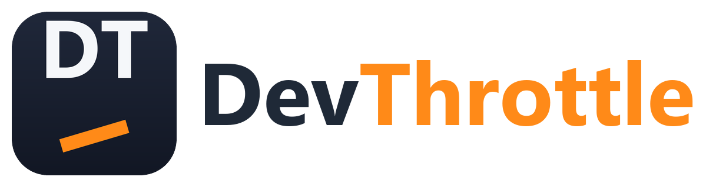
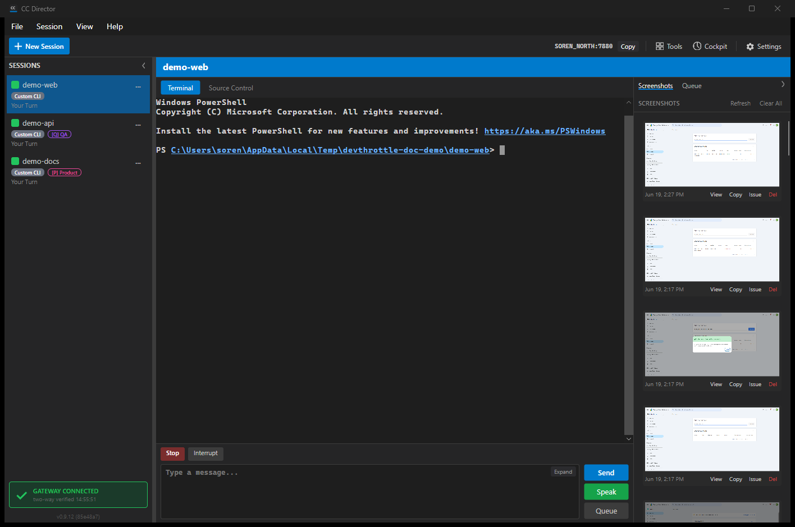

  

<h1 align="center">DevThrottle</h1>

<b>Mission control for command-line coding agents.</b> 
Run a whole fleet of coding agents at once -- each on its own repo -- from one Windows app, and steer them by voice from your phone.

  

Your job stopped being typing code -- it's watching agents work. DevThrottle is where you watch them: the open source orchestration tool for command-line coding agents.

## Why DevThrottle

- **Run many agents at once -- and many *different* agents.** Claude Code, OpenAI Codex, Cursor, GitHub Copilot, Gemini, opencode, Grok, Pi, or any CLI you bring -- side by side, each on its own repository, in one app.
- **Know the moment an agent needs you.** DevThrottle watches every session and surfaces the ones waiting on you -- on your desktop or your phone. The watching part nobody else built.
- **Supervise from anywhere.** Voice control and a voice-first mobile app, over a gateway we host for you -- so the machines at home and at the office are reachable wherever you are, with nothing of your own to keep running.
- **Up and running in about five minutes.** A dead-simple installer -- no admin, no terminal wrangling, no WSL. From download to your first agent in minutes.
- **Install it without an account.** The Director is free and installs and runs with no sign-up. You sign in later, only when you connect a gateway.
- **Open source, signed, yours.** MIT licensed, and the Windows installer is code-signed.

## Get DevThrottle

Installing DevThrottle is two steps, and only the second one asks who you are.

### Step 1 -- install the Director (free, no account)

The Director is the app: it runs your agents, watches them, and ships the `cc-*` command line tools. It installs and runs **with no account and no gateway**. Nothing is gated behind a sign-up, and nothing needs administrator rights -- everything lands under your own user profile.

Three ways to get it, all the same install:

| | How |
|---|---|
| **Download it** | **[devthrottle.com/download](https://devthrottle.com/download)** -- pick your platform and run it. No sign-up. |
| **By prompt** | Paste [one prompt](docs/install/install-prompt.md) into a coding agent you already have and it installs the Director for you, unattended. |
| **From a release** | The same assets, direct: [latest release](https://github.com/thefrederiksen/devthrottle/releases/latest). |

The wizard is three screens -- Welcome, Install, Complete. There is no role to choose and no sign-in to get past.

### Step 2 -- connect a gateway (this is where you sign in)

The gateway is what makes DevThrottle reachable beyond the one machine: your agents on your phone, voice control, and the morning report. The Director asks you about it on its second setup screen, and **"Not now" is a real answer** -- the app stays fully usable on this machine without one.

| | |
|---|---|
| **Hosted gateway** *(recommended)* | We run it. Sign in and the machine is enrolled -- phone, voice and the morning report work immediately. Part of **Pro**; see [pricing](https://devthrottle.com/pricing). New accounts start on a 14-day Pro trial, no card. |
| **Self-hosted gateway** | Run the gateway on your own machine and join it. Windows only, and it still needs a DevThrottle sign-in. For advanced setups. |
| **Not now** | Local-only on this machine. Connect any time from Settings. |

Either gateway needs a DevThrottle login -- with Google, GitHub, or an email and password. There is no bring-your-own-key: inference always routes through DevThrottle, which is exactly why connecting a gateway asks you to sign in.

  

---

DevThrottle is open source (MIT) -- this repo is the source, and you're welcome to read it. The Director installs and runs free, with no account; a DevThrottle login is needed only to connect a gateway. The product experience, onboarding, and support live at <a href="https://devthrottle.com">devthrottle.com</a>. It's MIT, so you can always fork it.
