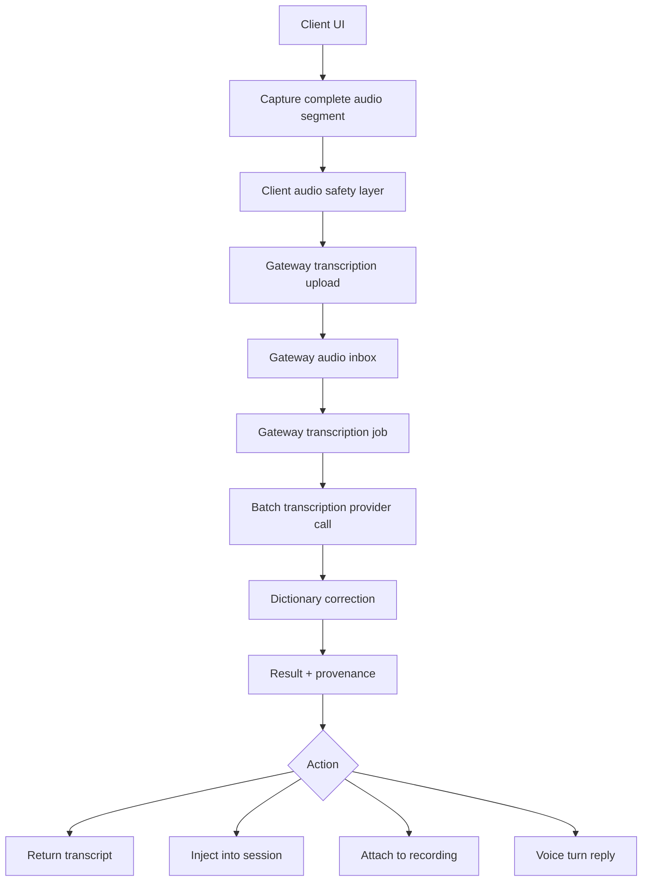

# Gateway Transcription Protocol

## Goal

All DevThrottle transcription must use one protocol owned by the Gateway.
Clients capture audio, protect it, upload it, and then watch status. The Gateway
does every transcription, retry, provider routing, dictionary correction, audit
write, and post-transcription action.

## Non-Negotiable Rules

| Rule | Meaning |
| --- | --- |
| Batch transcription only | Clients may stream audio bytes for upload, but transcription starts from a complete captured clip or segment. No streaming transcription or partial transcript generation. |
| Clients protect audio | Mobile and PWA clients persist audio locally before network risk. Desktop fire-and-forget sends persist audio before transcription risk. |
| Gateway transcribes | No client, Director, or desktop code calls a transcription provider directly. |
| One protocol | Every surface uses the Gateway transcription job protocol, even when the final action differs. |
| Status is first class | Upload, assembly, transcription, correction, retry, failure, and completion are observable. |
| Results carry provenance | Every transcript has a Gateway job id and protocol version. |

## Target Flow



## Client Responsibilities

| Responsibility | Details |
| --- | --- |
| Capture | Record the utterance or segment completely before requesting transcription. |
| Preserve | Keep audio until Gateway confirms a terminal result or the clip expires by policy. |
| Upload | Send audio quickly using chunked, resumable upload where useful. |
| Retry upload | Retry failed chunks and resume from persisted audio. |
| Display status | Show Gateway job status and allow retry when the Gateway says it is retryable. |

Clients must not:

- Resolve transcription providers.
- Hold OpenAI-compatible transcription URLs.
- Call `/audio/transcriptions`.
- Instantiate `BatchTranscriptionPipeline`.
- Apply transcript cleanup or dictionary correction.

## Gateway Responsibilities

| Responsibility | Details |
| --- | --- |
| Own upload ids | Idempotent upload ids and completion single-flight. |
| Validate chunks | Per-chunk SHA checks and missing-chunk reporting. |
| Persist audio | Keep audio while queued, retryable, or needed for audit. |
| Assemble audio | Rebuild final audio in order before transcription. |
| Transcribe | Use the single batch transcription service and provider routing. |
| Retry | Retry transient provider/network failures with backoff. |
| Correct | Apply the shared dictionary correction pass. |
| Publish status | Expose upload and transcription progress. |
| Deliver result | Return transcript, inject text, attach to recordings, or drive voice turns. |
| Stamp provenance | Include job id, protocol version, provider/mode, and timings. |

## Protocol

```text
POST /transcription/upload
PUT  /transcription/{jobId}/chunk/{index}
POST /transcription/{jobId}/complete
GET  /transcription/{jobId}/status
GET  /transcription/{jobId}/result
```

### Upload

`POST /transcription/upload`

Creates or reopens a transcription job.

Required behavior:

- Accepts an optional idempotency key.
- Returns `jobId`.
- Records intended action and context.
- Initializes status as `uploading`.

### Chunk

`PUT /transcription/{jobId}/chunk/{index}`

Stores one audio chunk.

Required behavior:

- Requires `X-Chunk-Sha256`.
- Accepts identical retries as no-ops.
- Rejects corrupt chunks.
- Updates upload progress.

### Complete

`POST /transcription/{jobId}/complete`

Declares upload completion and starts or resumes Gateway-owned processing.

Required behavior:

- Validates `totalChunks`.
- Reports missing chunks with `409`.
- Assembles audio.
- Queues or starts transcription.
- Is idempotent per `jobId`.

### Status

`GET /transcription/{jobId}/status`

Returns current job state.

Status names:

```text
queued
uploading
uploaded
assembling
transcribing
correcting
complete
failed_retryable
failed_final
expired
```

Progress fields:

```text
uploadReceivedChunks
uploadTotalChunks
transcribedParts
transcriptionTotalParts
percent
message
retryCount
nextRetryUtc
```

### Result

`GET /transcription/{jobId}/result`

Returns the terminal result when complete.

Required fields:

```text
jobId
protocolVersion
rawTranscript
cleanedTranscript
dictionaryApplied
status
mode
provider
startedUtc
completedUtc
action
```

## Actions

The upload protocol is the same for every surface. Only the completion action
changes.

| Action | Use |
| --- | --- |
| `return_transcript` | Pause, Insert, or any UI that needs text back. |
| `inject_session` | Speak Send into an existing session. |
| `recording_ingest` | Long phone recordings and transcript archive. |
| `voice_turn` | Voice-mode turn that transcribes, submits, summarizes, and speaks. |

## Enforcement

Gateway-only transcription is enforced by code structure and tests:

- `BatchTranscriptionPipeline` may only be referenced by Gateway transcription code and its tests.
- Client code may only reference Gateway upload/status/result clients.
- Old endpoints are deleted or become thin aliases that create Gateway jobs.
- Runtime transcript records must include a Gateway `jobId`.
- Architecture guard tests fail CI on forbidden transcription paths.

