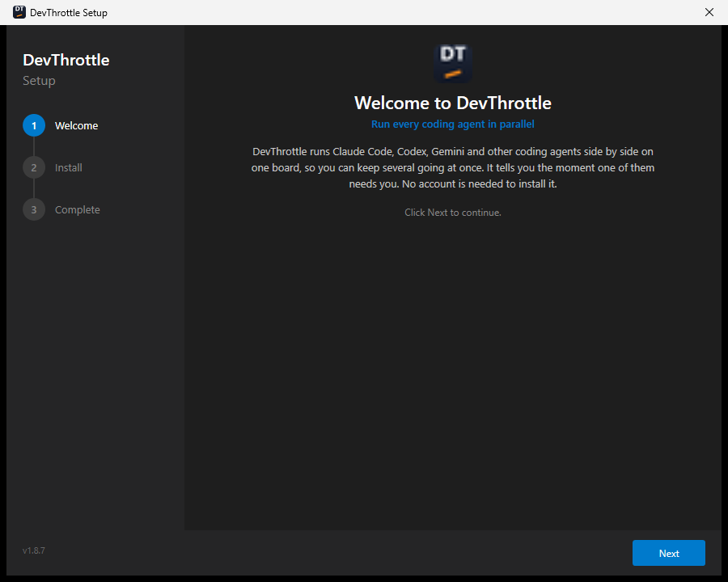
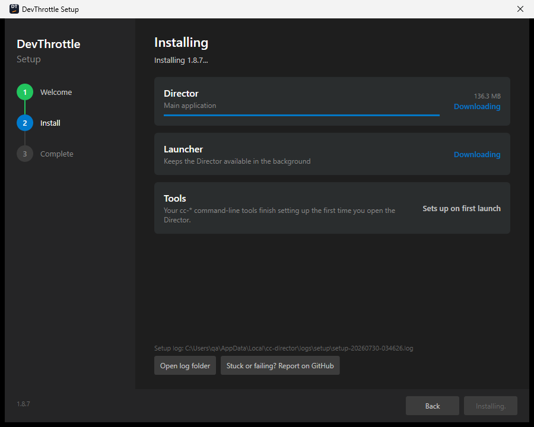
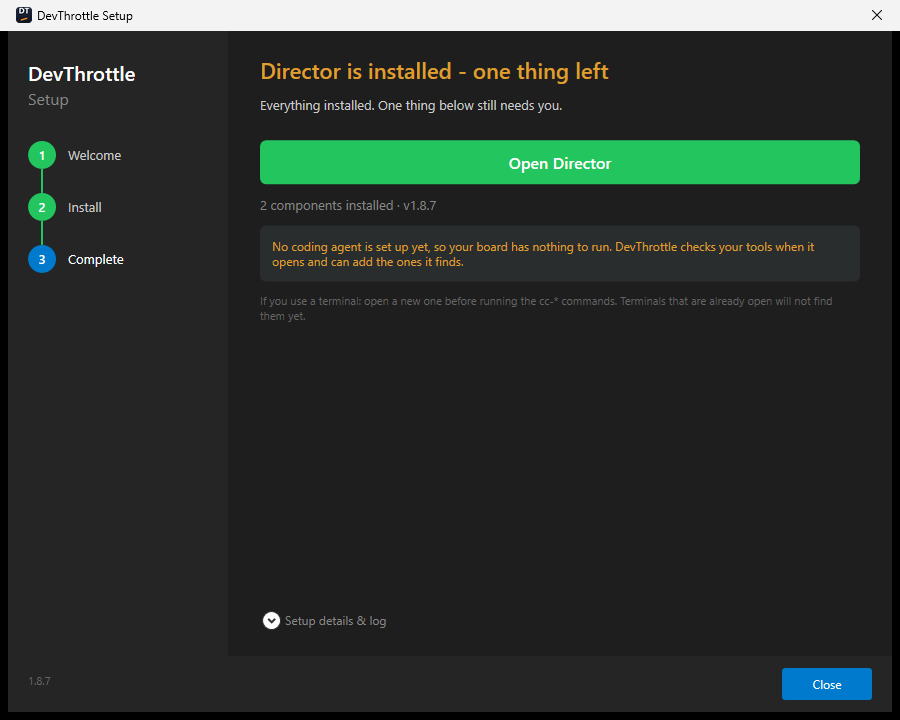
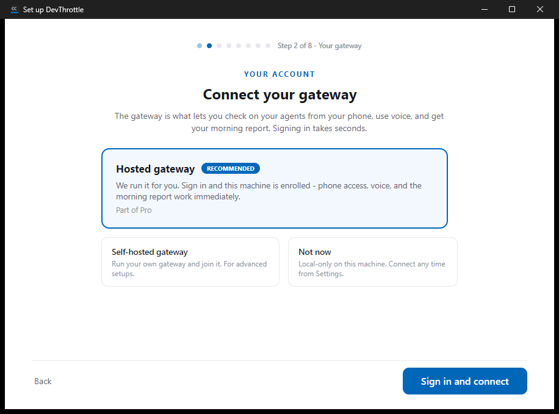

<!--
  SCREENSHOTS ARE PARTIAL. Tracked: thefrederiksen/devthrottle_internal#1053.

  Present: all three installer screens, and the setup wizard's Gateway step (step 2).
  Missing: setup wizard steps 1 and 3-8, including the zero-agent Agents frame.

  RESOLUTION, stated plainly because it was reported to me wrongly once: every frame on this page
  came from a 916x679 window (a 1024x768 desktop), NOT from a larger re-shoot. The larger re-shoot
  was reported as delivered and had not happened - the capture wrote into a directory that still
  held the previous run's files, skipped each shot it would have overwritten, and left the old file
  in place, so fetching by filename returned run one's image. Verify by HASH against the run you
  think you are taking from, not by filename or by a report.

  These two are still correct as illustrations at that size - "Step 2 of 8" is legible, so
  gateway-at-step-2 is provable from the pixel. Nothing on this page claims a resolution.

  Step 1 was captured but is NOT used: its list of what the wizard covers is cut off at the bottom.
  Do not repeat the claim that the window size causes that - #1046 is being corrected, and whether
  size is the cause was never measured. It is not used because the frame is a poor illustration,
  which stands on its own.

  Every image here was opened and looked at before use, never trusted from its filename. Three
  files in that run are byte-identical, so a filename is not evidence of what a frame shows.

  If you are adding the rest, read #1053 first. Two things matter more than the images:

    1. Caption every image with its step number from FirstRunWizardModel.CanonicalOrder.
       Gateway is step 2, NOT 7. Browsers is step 7, NOT 6. Three briefs got that wrong before the
       prose was fixed, and a caption is where the error comes back. The wizard renders
       "Step N of 8" next to its dots, so a wrong caption is checkable against the pixel.
    2. The Agents step needs the ZERO-AGENT frame. A found-state picture under this page's
       zero-state prose is the same failure that got the original sixteen deleted.
-->

# Setup Wizard Walkthrough

Getting DevThrottle running means going through **two** short wizards, and it is worth knowing
which is which:

| | Where it runs | What it is for |
|---|---|---|
| **[The installer](#part-1--the-installer-three-screens)** | **DevThrottle Setup**, before the app exists | Puts the files on the machine. Three screens, no decisions. |
| **[The setup wizard](#part-2--the-setup-wizard-eight-steps)** | Inside the Director, the first time you open it | Sets this machine up: your gateway, your agents, your code. Eight steps. |

The split matters, because it is where the account lives. **The installer never asks who you are.**
The Director installs and runs with no account at all. The one sign-in in DevThrottle is on the
*second* screen of the *second* wizard, it is about connecting a gateway, and **"Not now" is a real
answer**.

> Prefer no window at all? The [Installation](02-installation.md) page covers the command line
> installer and the one-prompt install. Both front-ends share a single install engine and produce
> exactly the same per-user layout under `%LOCALAPPDATA%\cc-director`.

---

## Part 1 -- The installer (three screens)

### Getting it

Download **DevThrottle Setup** from [devthrottle.com/download](https://devthrottle.com/download).
That page puts it better than this one can -- *"Download the Director. Free, no account needed"*, and
of the sign-in that comes later, *"This is the moment you sign in - never before it."*

> Go to `/download` directly. If you start at the DevThrottle home page instead, its main
> **Get started** button takes the account-first route -- its own rail reads "1 Account, 2 Download" --
> and you will be asked to sign up before you have downloaded anything. Nothing is wrong with that
> route, but it is not the one this page describes.

If you would rather verify the file yourself, take it from the
[latest release](https://github.com/thefrederiksen/devthrottle/releases/latest) instead --
`devthrottle-setup-win-x64.exe` plus `release-manifest.json` -- and check the hash before running it:

```powershell
$expected = (Get-Content release-manifest.json -Raw | ConvertFrom-Json).assets.'devthrottle-setup-win-x64.exe'.sha256
$actual   = (Get-FileHash devthrottle-setup-win-x64.exe -Algorithm SHA256).Hash.ToLower()
if ($actual -eq $expected.ToLower()) { "MATCH - safe to run" } else { "MISMATCH - do not run" }
```

The Windows binaries are code-signed as Center Consulting Inc. No administrator rights are needed at
any point.

### The three screens



*Installer screen 1 of 3 - Welcome. The rail shows the whole path: Welcome, Install, Complete. "No account is needed to install it."*

| Step | What happens |
|------|--------------|
| **1. Welcome** | Says what is about to be installed. On a machine that already has DevThrottle, this becomes the Update screen and is also where an uninstall starts. |
| **2. Install** | Downloads and places each component, with its own progress row. |
| **3. Complete** | Confirms what was installed and offers to open the app. |

That is the whole thing, and it is the same path for every install and every update.

**There is nothing to choose.** You are not asked to pick an install type, you are not asked for a
key, and you are not asked to sign in. The Welcome screen says so in as many words -- *"No account is
needed to install it"*.

The installer places the **Director** and the **Launcher**. The `cc-*` tools are listed too, marked
*"Sets up on first launch"* -- as the screen puts it, *"Your cc-\* command-line tools finish setting
up the first time you open the Director."* That is why you need a new terminal before they are on
your `PATH`. Every file placed is verified against the release manifest's SHA-256 before it lands,
though the screen does not say so while it works.



*Installer screen 2 of 3 - Install. Director and Launcher download; Tools reads "Sets up on first launch".*



*Installer screen 3 of 3 - Complete. "2 components installed" - the Director and the Launcher. On a machine with no coding agent it says so here, rather than letting you find out later.*

> **This used to be different.** Older versions of this page walked you through a **Workstation or
> Gateway** role picker, a **Prerequisites** screen, and a **Skills** screen. All three are gone:
>
> - The **role picker** is gone. Every machine gets the same install. Connecting a gateway is a
>   later, optional step done from the app.
> - The **Prerequisites** screen is gone. It existed for the one row that could actually block you --
>   the .NET runtime. Every Windows binary now carries its own runtime, so nothing needs to be on the
>   machine first.
> - The **Skills** screen is gone. Skills are held centrally and fetched by whichever agent uses one;
>   the installer places none.
>
> If you are following an older guide that tells you to run `setx OPENAI_API_KEY` before installing,
> stop -- that requirement was removed. DevThrottle has no bring-your-own-key.

### Updating or uninstalling

If DevThrottle is already on the machine, the wizard opens in **Update** mode. The Welcome screen
shows the installed version, the version available, and -- read only -- the install type it detected
from disk. It does not ask you to choose one. **Next** updates only the components that are behind.

The same screen is where **Uninstall DevThrottle** starts. The confirm screen explains that it
removes the Director, the Launcher, the tools and their integration from the machine, and lists them
under **What gets removed**.

Your data is **kept** by default. It goes only if you tick **Also delete my data**, which the screen
spells out as permanently removing config, vault secrets, signed-in browser sessions and recordings,
and warns cannot be undone.

Day to day you will not see this wizard again. Updates are silent and automatic -- no banner, no
prompt, no administrator rights.

---

## Part 2 -- The setup wizard (eight steps)

The first time you open the Director it walks you through eight steps. Every one of them is about
**this machine**, and every one can be skipped.

The wizard tells you where you are: beside the progress dots it reads **"Step N of 8"** followed by
the step's name. If your screen disagrees with the numbering below, trust your screen and please say
so -- the page is written against the shipping order, and that order has been got wrong before.

| # | Step | The question it answers |
|---|------|-------------------------|
| 1 | **Welcome** | What the next few minutes are for. |
| 2 | **Your gateway** | Do you want your agents on your phone? *This is the only step that involves an account.* |
| 3 | **Your agents** | Which coding agents are on this machine? |
| 4 | **Tools** | The `cc-*` toolbelt, installing itself. |
| 5 | **Your code** | Where do your repositories live? |
| 6 | **Screenshots** | Which folder do your screenshots land in? |
| 7 | **Browsers** | Should your agents be able to drive a real browser? |
| 8 | **Done** | A receipt of what was set up. |

### 1. Welcome

Previews what the wizard is about to ask you -- *"Five quick things, so DevThrottle knows this
machine. Skip any of them - all of it can be changed later."* -- and lists them: gateway, agents,
code, screenshots, browsers.

That preview is five items, but the counter reads "Step 1 of 8" and there are six real steps between
here and the end. The difference is the two bookends, plus Tools, which sets itself up and asks you
nothing. Nothing is hidden from you; the preview simply lists the steps that want an answer.

Two ways on: **Set me up**, or **Skip setup and figure it out myself**.

### 2. Your gateway

The gateway comes second on purpose. Connecting is *who you are*; everything after it configures one
particular computer. It is also the step that carries the real payoff, so it sits where it will
actually be seen rather than five screens in.

> The gateway is what lets you check on your agents from your phone, use voice, and get your morning
> report.



*Setup wizard, **step 2 of 8** - Your gateway. The counter beside the dots reads "Step 2 of 8": the gateway is the second screen, not the seventh. Hosted is pre-selected, marked RECOMMENDED, and priced as "Part of Pro" with no figure.*

Three cards:

| Card | What it means |
|---|---|
| **Hosted gateway** *(recommended, pre-selected)* | We run it. Sign in and this machine is enrolled -- phone access, voice and the morning report work immediately. Part of **Pro**; see [pricing](https://devthrottle.com/pricing). |
| **Self-hosted gateway** | Run your own gateway and join it. For advanced setups. |
| **Not now** | Local-only on this machine. Connect any time from Settings. |

The hosted card's button reads **Sign in and connect**. It opens your browser, and the wizard waits:
*"We opened your browser to sign you in with Google, GitHub, or email. This window continues
automatically when you are done."* There is a **Cancel sign-in** link, and the primary button greys
out while it waits.

The browser page says what it is for -- *"Sign in to connect the Director on this machine"* -- and
offers three ways in:

| | What happens |
|---|---|
| **Continue with Google** | One click, if you are already signed in to Google in that browser. |
| **Continue with GitHub** | The same. |
| **Continue with email** | *"We'll email you a link to sign in - no password needed."* You get a **link**, not a password box. |

**The email route sends you to your inbox, so pick Google or GitHub if you can.** There is no password
field on that page at all -- even if you set a password when you created the account. Signing in by
email means leaving the machine you are setting up, opening your mail, and clicking a link. On a
freshly installed Windows box with no mail client configured, that means a second device. The wizard
will wait as long as it takes, but "when you are done" can be a trip across the room.

If you signed up on the website a moment ago, your browser still holds that session, and this step
costs **zero clicks and about five seconds**: the tab says *"Signed in to DevThrottle. You can close
this tab and return to the Director"* and the wizard is already showing **Connected**, naming the
gateway this machine is now enrolled with. That is the whole of it.

If the sign-in does not complete, the step says so and offers **Try again**. It never carries on as
though it had worked.

**This is not a gate.** "Not now" is as easy to click as the other two, and everything else in
DevThrottle works without it. A first screen that read as sign-up-to-continue would change what the
product is.

### 3. Your agents

Scans the machine for coding agents -- Claude Code, Codex, Gemini, Copilot, Cursor, Grok, opencode,
Pi -- and lists what it found.

This is the one step that will not let you sail past a genuine problem. On a clean machine it will
find none, and it says so plainly -- *"You need a coding agent"* -- explains that DevThrottle runs and
supervises command line coding agents and did not find any here, lists the eight it knows, and gives
you three ways forward:

| Button | What happens |
|---|---|
| **Install Claude Code for me** | Installs it right there. Takes about a minute; you sign in to Claude the first time an agent starts. |
| **Re-check** | Scans again, for when you have just installed one yourself. |
| **I'll do this later** | Carries the job forward as a to-do rather than pretending it is done. |

### 4. Tools

The `cc-*` command line tools, which DevThrottle installs and keeps current itself -- you never run
an updater. The heading carries the count, so it reads **"9 tools, maintained for you"**, and each
tool has its own row and state.

If a tool has not arrived, the step offers **Fix this now** -- the same repair the Home screen runs.

> **Do not treat this screen as the last word on whether a tool works.** It can report every tool
> installed and up to date while the Home screen disagrees about one of them. Check with
> [`status --json`](#verifying-the-install) below if it matters.

### 5. Your code

Finds your git repositories and adds them, so DevThrottle can offer them when you start an agent.
Remove any you would rather it left alone.

On a machine that has none yet, it says so -- *"No repositories found in the usual places. Browse to
where your code lives."* -- and gives you **Browse...** and **I don't have code on this machine yet**.
Neither one blocks you.

> If you are starting from nothing, note that DevThrottle does not install **git** for you, and you
> need it before you can clone anything. See [Recommended, not
> required](02-installation.md#recommended-not-required).

### 6. Screenshots

Snap a screen, drag the image straight onto an agent -- the fastest way to show it exactly what you
mean. DevThrottle watches one folder for new screenshots.

On a new Windows machine there is usually no screenshots folder yet -- Windows does not create one
until you take your first screenshot -- so the step will tell you honestly that it could not find one:
*"We could not detect where your screenshots go. Browse to the folder, take a screenshot and we will
find where it lands - or just continue; you can set this any time in Settings."*

Once a folder exists, the step guesses it, tells you where the guess came from, and shows your most
recent images as proof it picked the right one. Either way, **Take a screenshot and we'll find it**
does the work for you: press your normal screenshot shortcut and the wizard watches where the file
lands.

### 7. Browsers

An agent can drive a real browser that is already signed in to your accounts -- reading a dashboard,
filling in a form, checking a page for you.

This step is last of the real steps because it is the one that may ask you to sign in to something,
and that cannot be hurried. It recommends setting up now, and names the tool and who makes it before
you accept. If the install fails it says so and links the manual page; it never continues as though
it had worked. The way out -- **Set up browsers later** -- names where later happens: the Browsers
group in the left rail does the same job.

### 8. Done

A receipt of what was actually set up, then **Start my first agent** or **Take me to the board**.

> Start an agent on one of your repos -- give it a small task and watch the card, not the terminal.
> Tomorrow morning, DevThrottle reports back on how it went.

**There is no morning-report step**, and that is deliberate. The report is one person, one email,
delivered through the gateway. Asking about it here would ask the same person the same question again
on every machine, and write the answer somewhere the other machines could not see it. You set it up
once, for your account, not once per computer.

---

## Verifying the install

Ask the installer, which reports on the whole install rather than one piece of it:

```powershell
devthrottle-setup-cli-win-x64.exe status --json
```

Then open a **new** terminal -- one that was already open still has the old `PATH` -- and confirm the
tools are on it:

```powershell
cc-devthrottle --version
```

> Pick any `cc-*` tool you like for that check, but be aware that a single tool failing does not mean
> the install failed. `status --json` is the answer that covers everything; one tool that did not
> arrive is repaired from the Home screen, not by reinstalling.

The installer writes a detailed log for troubleshooting:

```
%LOCALAPPDATA%\cc-director\logs\setup\setup-<timestamp>.log
```

From here on, updates are automatic and silent -- the app keeps every component current in the
background, with no prompts and no administrator rights. See
[Installation](02-installation.md) for the details.
