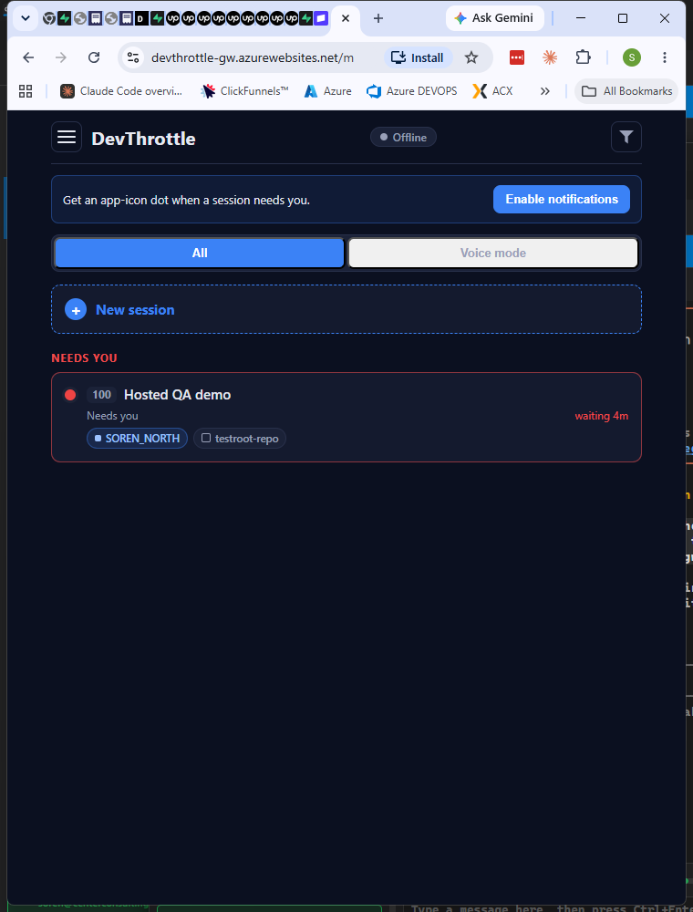
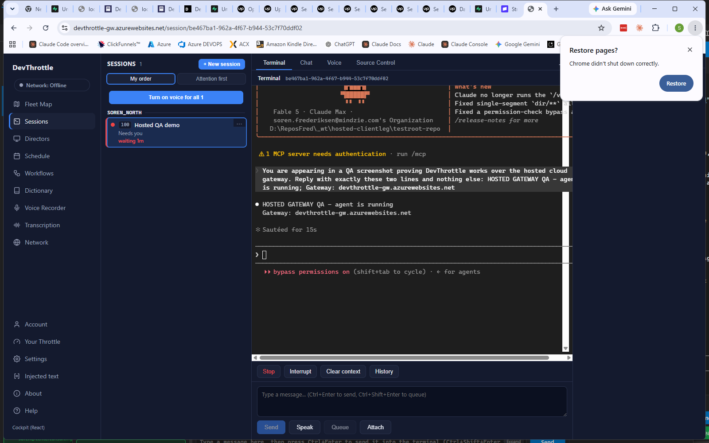
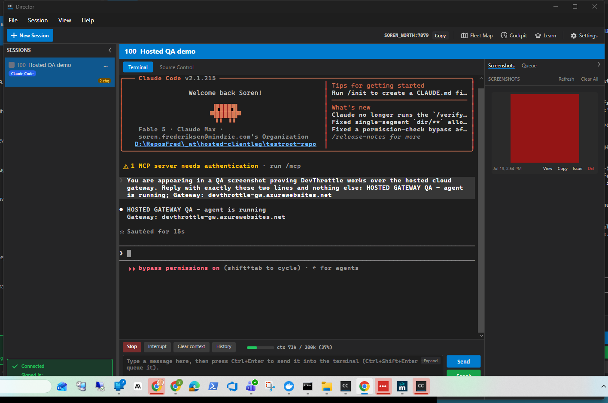
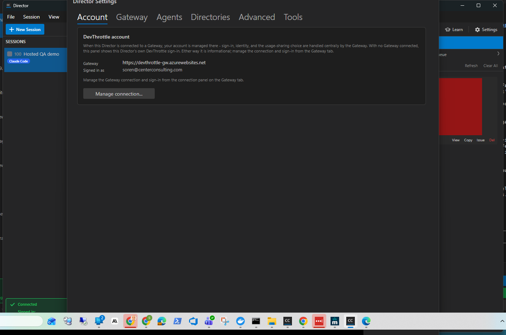

# Hosted gateway QA report - 2026-07-20

DevThrottle driven end to end against the **hosted** cloud gateway: the phone view, the cockpit,
and cc-director itself, each with a real session and an agent that actually ran.

---

## Read this before the screenshots

**"Merged on main" and "proven on the running box" are two different lists today, and this report
keeps them apart deliberately.** Collapsing them would make the running system look safer than it
is, which is the dangerous direction to be wrong in.

| | |
|---|---|
| **Configured image on the box** | `sha256:07c86e1bbbdf3bafbb5d7d13848ab2d5945f1979cc6a443e590aba514ff9fd4f` |
| Full reference | `crdevthrottlehg.azurecr.io/devthrottle-gateway@sha256:07c86e1b…` |
| App | `devthrottle-gw`, resource group `rg-devthrottle-hosted-gateway` |
| App last modified | 2026-07-20 03:09:15Z |
| Screenshots taken | 2026-07-20 03:19Z - 03:24Z |
| Account | `soren@centerconsulting.com` (see "Why not a dummy account") |

**How the image was established, and its one soft edge.** The digest above is the **configured**
image, read off App Service with `az webapp config container show` by the mission's docs lane. I
could not read it myself - the Azure CLI on this machine is signed in as a different identity and
cannot see these resources, which is issue #1882. Strictly, *configured* and *running* are two
claims. What closes the gap from the other side is behavioural and is mine: the cockpit and mobile
assets **are being served**, and the previous image did not serve them. So configuration and
behaviour agree.

**A previous record cites `sha256:8a05ae6b`.** That is the digest the earlier connect-and-works
proof was taken against. The box has moved on. Nothing in this report was captured against it.

---

## The three things that work

### 1. Phone view - `/m` on the hosted gateway



*Captured 2026-07-20 03:22:19Z against configured image `sha256:07c86e1b…`.*

Address bar reads `devthrottle-gw.azurewebsites.net/m`. Session **100 "Hosted QA demo"**, "Needs
you", on `SOREN_NORTH`, repo `testroot-repo`. The session number was issued by the hosted gateway.

### 2. Cockpit - in a browser on the hosted gateway



*Captured 2026-07-20 03:19:10Z against configured image `sha256:07c86e1b…`.*

Address bar reads `devthrottle-gw.azurewebsites.net/session/be467ba1-…`. The **live terminal** is
rendering through the cloud, showing the prompt and the agent's reply. This is the surface that was
completely dead earlier today (#1869) - every per-session route returned "session not found across
any director" while the roster looked healthy.

### 3. cc-director itself, connected to hosted, with an agent that ran



*Captured 2026-07-20 03:23:26Z against configured image `sha256:07c86e1b…`.*

Session **100** in the rail, "Connected", and the terminal showing the agent's own output:

```
HOSTED GATEWAY QA - agent is running
Gateway: devthrottle-gw.azurewebsites.net
```

That text came from the agent, not from the roster. It is confirmed in the session transcript at
`…/D--ReposFred--wt-hosted-clientleg-testroot-repo/37f938f1-….jsonl`, so this is a turn that
actually executed - not a row in a list.



*Captured 2026-07-20 03:23:59Z against configured image `sha256:07c86e1b…`.*

The unambiguous marker, from the Director's own state rather than from anything typed:

- **Gateway: `https://devthrottle-gw.azurewebsites.net`**
- **Signed in as: `soren@centerconsulting.com`**

This also shows #1856 fixed on the deployed box - an enrolled hosted machine used to report itself
as signed **out**.

---

## What does not work yet

Nothing here is a mistake on your part. Each item is known and has an owner.

### Voice output is inert - and voice is now part of the launch

Text-to-speech on hosted returns **HTTP 503**:

```
POST /wingman/tts
{"error":"no DevThrottle account key configured in the gateway vault - sign in to DevThrottle"}
```

So narration cannot be generated on the hosted gateway at all, as of **2026-07-20 03:24Z**. Voice
mode on the session reports `Voice off`, `canGenerate: false`. This is stated as a headline rather
than a footnote because of the ruling that voice ships with Pro rather than being marked "coming
soon". It was moving overnight, so re-check the timestamp before trusting this line.

### The security denies are merged, NOT on the box

Four pull requests - the lock, the stats deny, the voice partition and the billing gate - are on
`origin/main`. The **running image does not carry them**. Every screenshot above therefore shows
**pre-deny behaviour**: a true picture of the box, and a false picture of the code. Deploy-by-digest
and the live proofs were still outstanding when this was written.

### Dictation is dead by design

The five `/dictation/*` routes are deliberately switched off on hosted (#1884). Turning them on
would have activated a path whose upload store is keyed only by a caller-supplied upload id with no
tenant on it, so one account could have claimed another's upload id and been handed its transcript.
Off is the correct state until that is fixed.

### The cockpit and phone both show "Offline"

Visible in both screenshots: an **Offline** badge in the sidebar and phone header, while the same
page is successfully listing live sessions from the cloud. The indicator disagrees with the page it
sits on. Cosmetic, but it is the kind of thing that makes a working system look broken. **Not yet
booked** - it needs a few minutes to find which check drives it before filing something accurate.

### `/login` rejects a valid device key

If you find `/login` on the hosted gateway and paste a device key, it returns 401 - even though the
same key authenticates perfectly well as a cookie. Anyone debugging cockpit access will try that
first and conclude their credential is broken when it is fine. Booked in #1892; the fix is to make
the refusal say what `/login` actually wants.

### Cross-account isolation is not shown here

This rig has **one account**, so it can show that the correct tenant reaches its own sessions and
that no credential reaches nothing. It cannot show that a second account is kept out. That column
belongs to a separate two-account harness and is not claimed by this report.

---

## Why not a dummy account

A dummy was the stated preference. Enrolment is what binds a device key to an account, and this
rig's key is already bound to `soren@centerconsulting.com` and was used for the verified proofs
earlier today. Re-enrolling to a fresh account would have destroyed the verified rig in the middle
of producing this report, so the fallback was taken deliberately rather than by accident.

---

## How to reproduce this

The setup is documented in two places:

- [trying-hosted-devthrottle.md](../trying-hosted-devthrottle.md) - plain-English start/stop
  instructions and the three double-clickable scripts
- [hosted-real-director-test-rig.md](../hosted-real-director-test-rig.md) - the engineering detail,
  including the `CC_DIRECTOR_ROOT` storage-migration trap

One safety note that governs both: the everyday Director on this machine is the one running the
whole agent fleet, and it must never be pointed at hosted. Everything above was done with a
separate, isolated slot Director.
